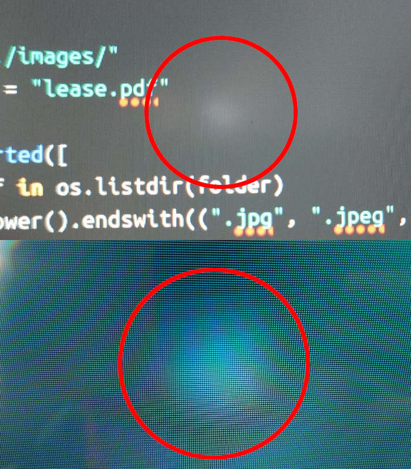
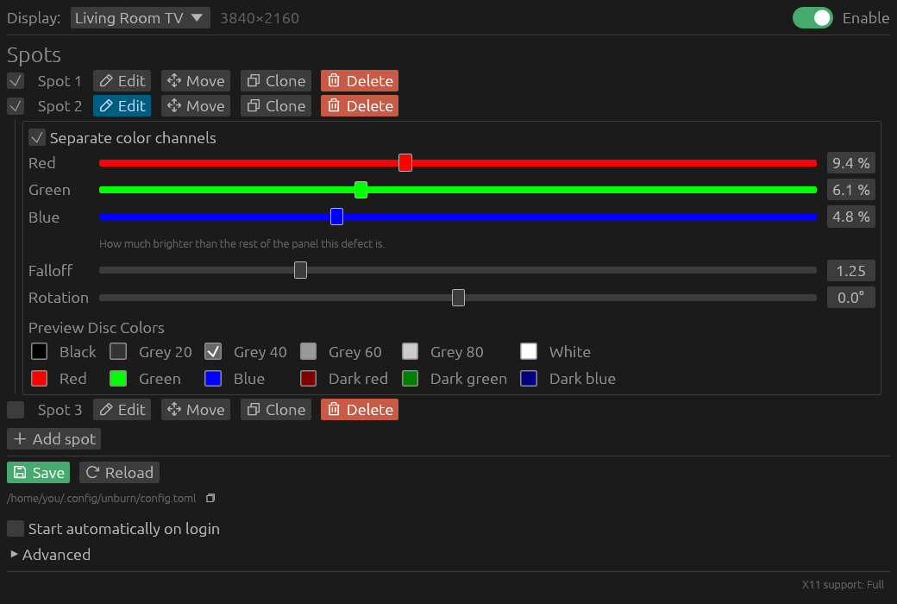

# [unburn.tv](https://unburn.tv)

Corrects OLED and LCD mura, also known as "backlight bleed", that appear due to aging or applied pressure.

The app draws an overlay over other windows that compensates for the increased brightness. The position, size and color parameters of the defects are configurable via a visual editor.

